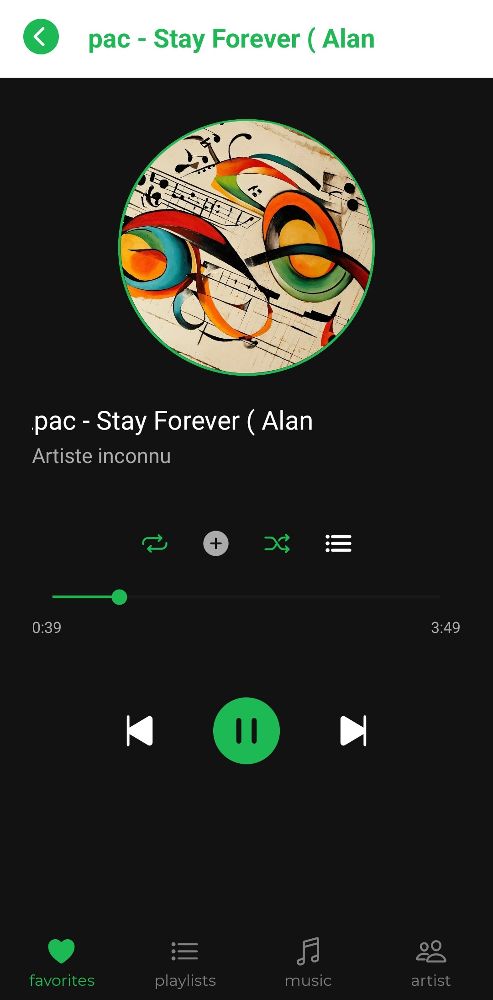
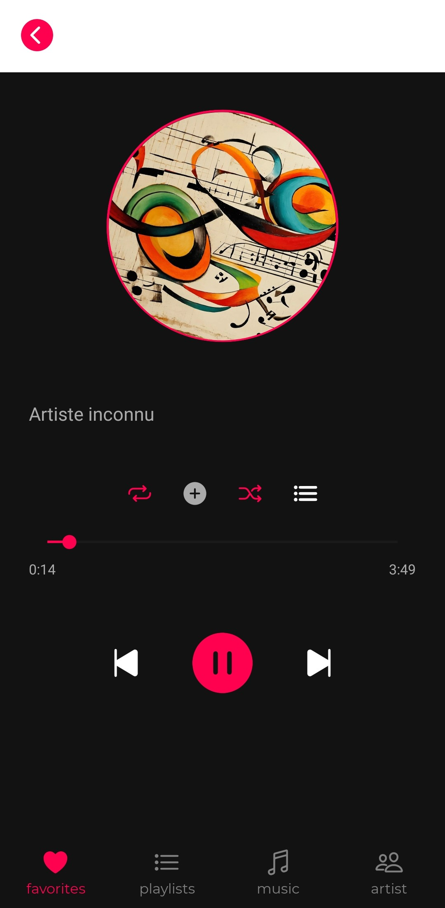
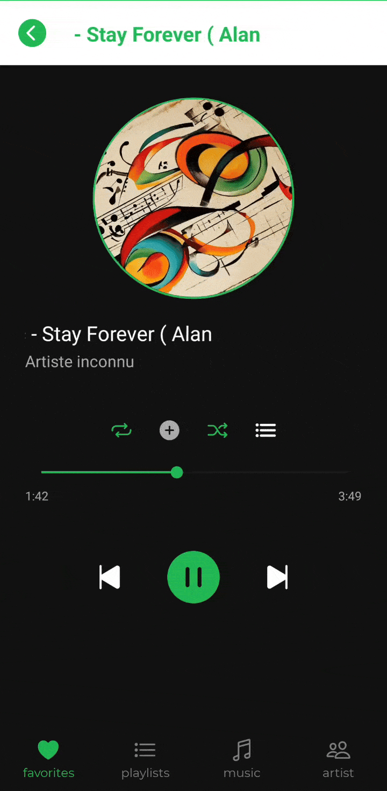
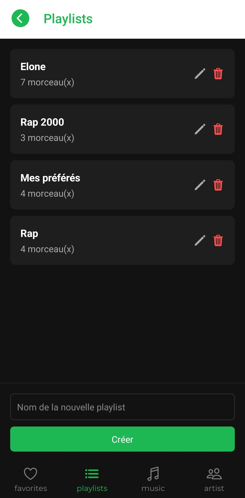
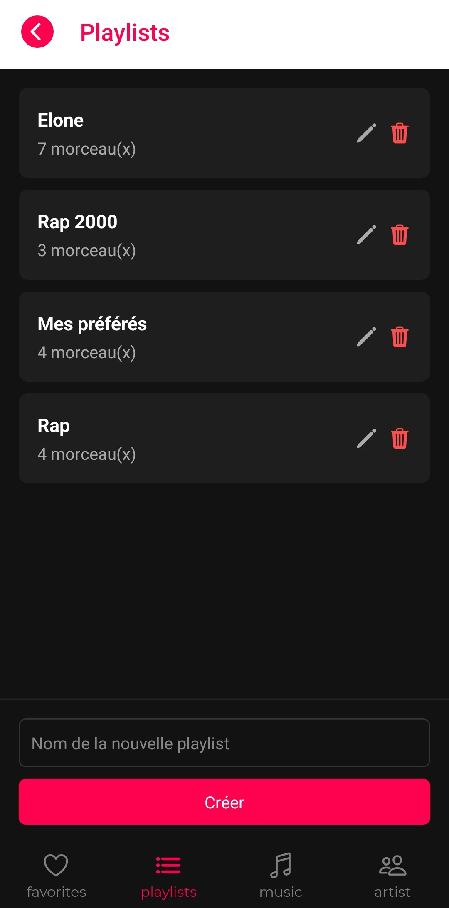
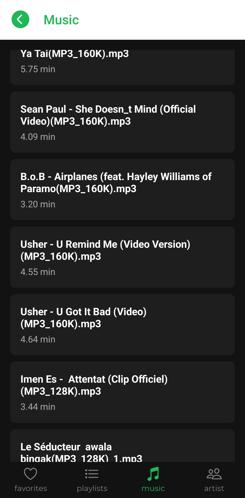
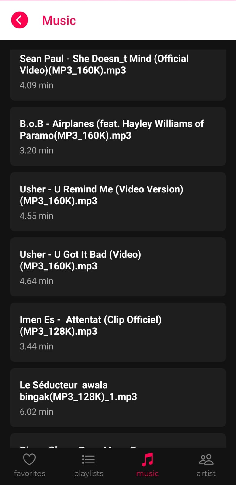
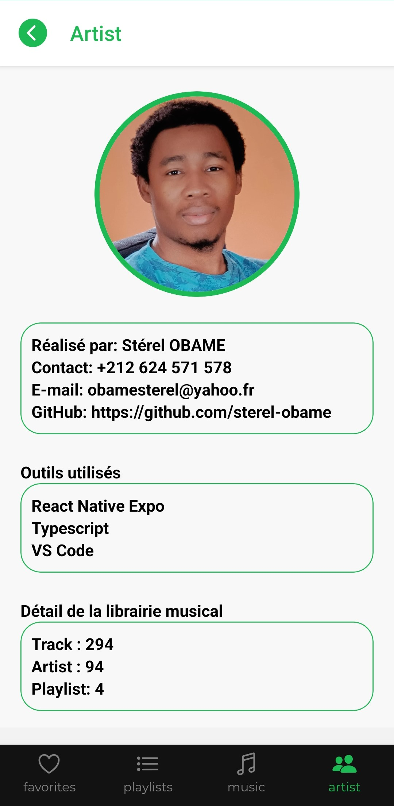
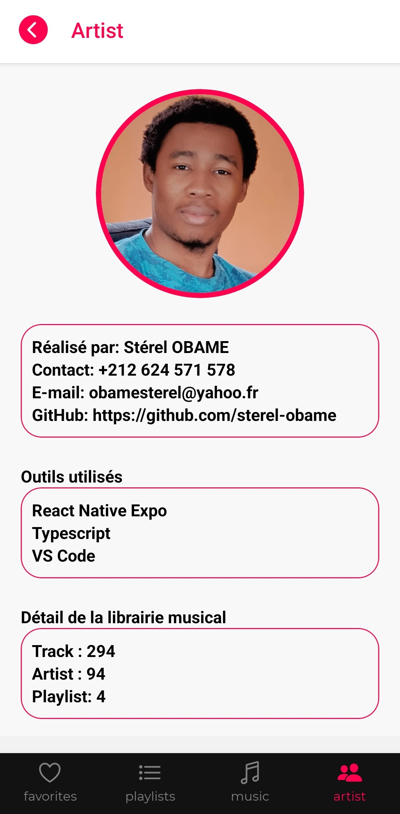

#      🎵 React Native Music-player 🎵


##    Une application mobile de lecture de musique construite avec React Native, Expo et TypeScript.

---

## 🎨 Aperçu visuel

|----------------------------------------|--------------------------------------|------------------------------------|
|  |  |  |
|   |   |    |
|      |     |                                    |
|     |     |                                    |


---

## 📱 Description

**React Native Music-player** est une application mobile moderne qui permet aux utilisateurs d’écouter leur musique préférée en toute simplicité. L’interface est épurée et intuitive, avec des fonctionnalités classiques d’un lecteur audio : lecture, pause, navigation entre les morceaux, et affichage dynamique.

---

## ⚙️ Fonctionnalités principales

- 🎧 Lecture, pause et navigation entre les pistes
- ➕ Création et suppression des playlists
- 📂 Chargement des fichiers audio depuis le téléphone
- 🎵 Affichage des métadonnées de la musique (titre, artiste, etc.)
- 🌙 Mode sombre
- 📱 Compatible iOS & Android

---

## 🛠️ Outils et technologies

- [React Native](https://reactnative.dev/)
- [Expo](https://expo.dev/)
- [TypeScript](https://www.typescriptlang.org/)
- [React Navigation](https://reactnavigation.org/)
- [Expo-av](https://docs.expo.dev/versions/latest/sdk/av/) pour la lecture audio
- [Expo-file-system](https://docs.expo.dev/versions/latest/sdk/filesystem/)
- [Expo-secure-store](https://docs.expo.dev/versions/latest/sdk/securestore/) (Pour la persistance des données. )

---

## 🚀 Lancement du projet

```bash
# Cloner le dépôt
git clone https://github.com/sterel-obame/music-player.git
cd music-player

# Installer les dépendances
npm install

# Lancer le projet
npx expo start
